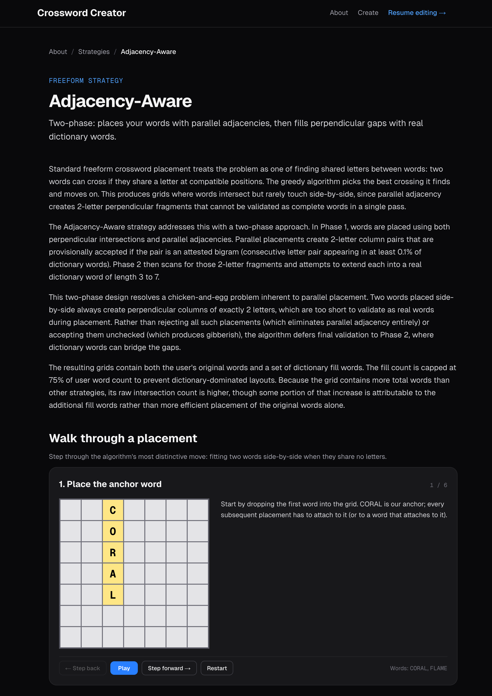
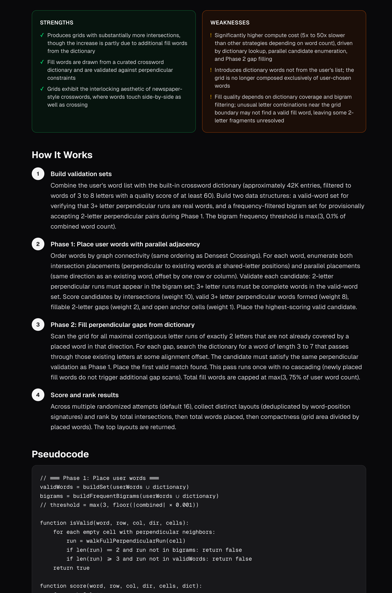
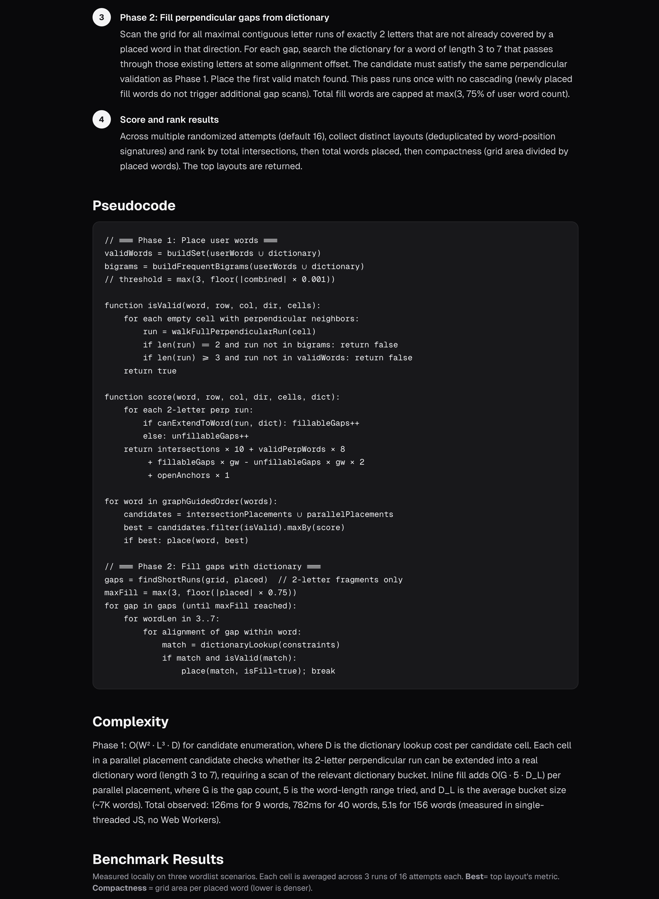

# Crossword Creator

A web-based crossword creator that builds packed, real-style puzzles around **your own word list**. Most existing crossword tools either fill grids from a generic dictionary, or hand you a blank grid and ask you to place words by hand. This one takes the words you actually care about (a theme, a vocabulary set, names of friends, anything) and generates a crossword around them, with dense intersections and a NYT-style solver UI. Finished puzzles can be shared via short URL.

**Live site:** [TODO: add URL after deployment]


> _Building a freeform puzzle with the adjacency-aware strategy. For an interactive walkthrough of the engine internals (including step-throughable demos of each generation strategy), see the **How It Works** page on the live site._

## What it does

Three different builders, each producing a different kind of crossword:

1. **Freeform**: pick a strategy, hand the engine a list of words, get a packed grid. Three strategies are available:
   - *Densest crossings*: maximizes letter intersections at the cost of less predictable shapes.
   - *Balanced*: trades some density for more uniform grid silhouettes.
   - *Adjacency-aware*: extends placement past pure letter intersections by validating side-by-side word adjacencies against an English bigram table, allowing words that share no letters to still sit next to each other.
2. **Block Builder** (WIP): anchors the user's words, then carves a newspaper-style block grid around them in a three-phase pipeline: scaffold, shrink-and-carve, dictionary fill. Currently produces real interlocking words across most slots but still leaves occasional 2-letter artifacts; flagged in the UI.
3. **Guided Builder**: start from a fixed 5x5, 7x7, or 15x15 grid pattern with optional 180° rotational symmetry. Click any slot to see every word that fits given the letters already pinned at crossing points; intersecting slots' candidate lists update in real time as you commit each word ([constraint propagation](#a-note-on-ac-3-arc-consistency)).

Finished puzzles can be saved (Redis-backed storage), shared via short URL, and solved in a keyboard-navigable solver that supports check/reveal, direction toggling, and editing your own puzzles after sharing.

## A peek at the About page

<p align="center">
  
  
</p>
<p align="center">
  
</p>

## Architecture

```
src/
  app/
    create/          Editor flows: freeform, guided, edit, share, preview
    solve/[id]/      Solver page (keyboard nav, check/reveal, edit)
    about/           How-It-Works page with interactive demos
    api/puzzles/     POST/GET routes backed by Vercel Redis
  engine/
    wordindex.ts     Trie + position-letter index for fast candidate lookup
    constraints.ts   Constraint propagation (AC-3) with bitset domains
    solver.ts        Backtracking solver with MRV + LCV heuristics
    freeform.ts      Three placement strategies, returns multiple solutions
    block-builder.ts Three-phase scaffold/carve/fill pipeline
    suggestions.ts   Gap analysis, feasibility scoring, cascade ranking
    worker-pool.ts   Web Worker fan-out for diverse parallel solutions
  lib/puzzle/        PuzzleStore abstraction (Redis impl), my-puzzles tracking
```

The engine is written entirely in TypeScript with no third-party CSP library. The dictionary (~42K words) is the [Collaborative Word List](https://github.com/Crossword-Nexus/collaborative-word-list) (MIT). Loaded on demand and cached.

## Tech stack

- **Next.js 16** App Router, **React 19**, **TypeScript 5**
- **Tailwind 4** for styling
- **Vercel Redis** (Redis marketplace integration) for puzzle storage
- **Vitest** for engine unit tests
- **Web Workers** for non-blocking parallel generation

## Local development

```bash
npm install
npm run dev
```

Open http://localhost:3000.

For Redis-backed sharing, set `REDIS_URL` in `.env.development.local`. Without it, the share/solve flow will fail; the editor and standalone generators work without it.

## Scripts

| Command | What it does |
| --- | --- |
| `npm run dev` | Start the Next.js dev server |
| `npm run build` | Production build |
| `npm test` | Run Vitest engine tests |
| `npm run lint` | ESLint check |

## A note on AC-3 arc consistency

A crossword is a constraint satisfaction problem (CSP): each slot is a variable, its candidate words are its **domain**, and any two slots that share a cell are linked by a **constraint** (they have to agree on the letter at the shared position). Each such pair of slots is called an **arc**.

**Arc consistency** means: for every candidate word in slot A, there exists at least one candidate word in slot B that agrees on the shared letter. If no such B-word exists, the A-word is hopeless and gets removed from A's domain.

**AC-3** is the algorithm that enforces this everywhere. It keeps a worklist of arcs. For each arc, it prunes the domain of one slot. Any time a slot's domain actually changes, it pushes every arc touching that slot back onto the worklist, because removing a candidate from one slot can invalidate candidates in its neighbors. The process repeats until nothing changes.

Concretely in the guided builder: when you commit CORAL to a down slot, AC-3 walks every across slot that crosses it. For each one, it filters that slot's candidate list down to words that match the right letter at the crossing column. When the user then clicks one of those across slots, they see only the words that are still viable given everything placed so far. If any slot's candidate list collapses to zero, the user knows the current state is unsolvable without backing up.

The "3" is purely historical (AC-1 and AC-2 are older, less efficient variants); AC-3 is the practical baseline most CSP solvers use.

## Status

This is an in-progress personal project. The freeform engine and guided builder are functional; the block-builder is a proof of concept with known fill artifacts (see the WIP badge on the strategy selector). The solver UI matches the basics of NYT-style interaction (keyboard nav, direction toggle, check/reveal) but does not yet include a timer, pencil mode, or rebus cells.
